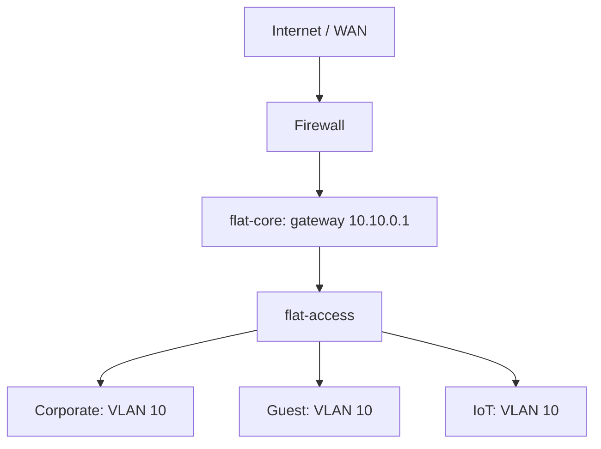
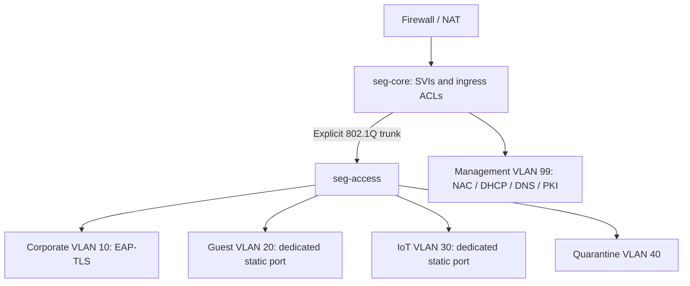
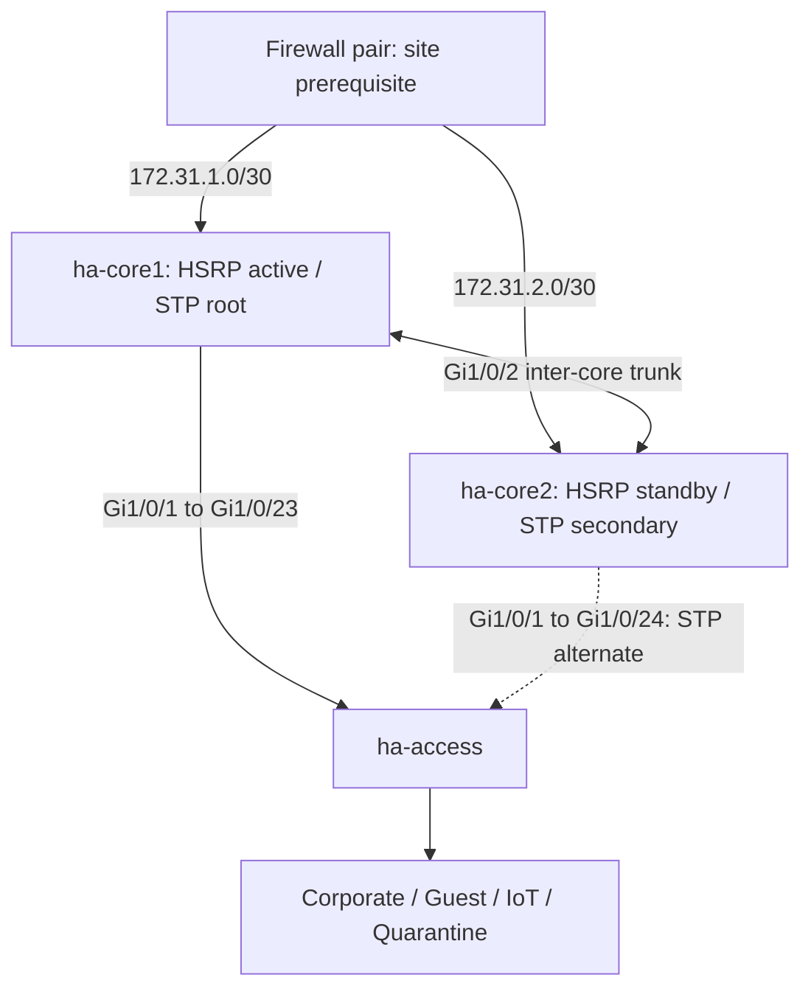

# Enterprise VLAN Segmentation with Microsoft Intune & Entra ID Integration

Reproducible Cisco IOS XE templates, Ansible drift management, and a Microsoft Graph compliance-to-RADIUS reference integration.

**Status:** engineering templates with offline validation. Qualify the switch model, IOS release, NAC adapter and tenant policies before production. No switches or tenant resources have been modified. The [acceptance runbook](docs/validation.md) defines the remaining deployment gates.

## Three network topologies

### Flat / Essential Single-Path Star



The intentional baseline shares one endpoint broadcast domain and management network. Port security and SSH restrictions do not provide zone isolation. 802.1X dynamic VLAN assignment and inter-zone ACLs are introduced in topology 2; multiple endpoint VLANs would invalidate the flat baseline.

### Segmented Wired Star



### High-Availability Segmented Star



Two independent trunks dual-home the access switch. RSTP changes the forwarding path; HSRPv2 retains the `.1` gateways. Core 1 uses `.2`, core 2 `.3`. DTP is disabled: explicit allowed VLANs prevent unintended negotiation. Independent cores must not share an ordinary LACP port-channel without a supported stack/MLAG design. See [HA and VRRP alternative](docs/ha.md).

## Identity flow

```mermaid
sequenceDiagram
    participant I as Intune / Entra
    participant E as Endpoint
    participant S as Access switch
    participant R as RADIUS / NAC
    participant P as Policy snapshot
    I->>E: Root CA, SCEP certificate, wired EAP-TLS settings
    I->>P: Graph export: compliance and eligible group
    E->>S: EAP-TLS handshake
    S->>R: RADIUS EAP exchange
    R->>R: Verify chain, revocation, EKU and device identity
    R->>P: Evaluate verified certificate GUID
    P-->>R: Corporate 10 / Quarantine 40 / reject
    R-->>S: Access-Accept tunnel attributes or Access-Reject
    S-->>E: Authorized VLAN; DHCP renewal on VLAN change
```

Intune delivers certificates; Entra dynamic groups scope eligible devices; RADIUS authorizes the VLAN. Conditional Access does not configure switch ports. The evaluator needs a NAC adapter and is not an NPS plugin. Traditional NPS uses AD-backed identity mapping rather than native Graph compliance evaluation. See [integration and NPS deployment](docs/identity-integration.md).

## Repository structure

```text
topologies/
  01-flat/          intent.json + configs/
  02-segmented/     intent.json + configs/
  03-ha/            intent.json + configs/
  templates/       switch.ios.j2
ansible/
  inventory.ini, ansible.cfg, requirements.yml, requirements.txt
  group_vars/all.yml
  golden/          generated per-switch resource models
  playbooks/       audit.yml, enforce.yml
  roles/vlan_enforce/tasks/{main,resources}.yml
intune_entra_id/
  scripts/         Graph helpers, group/SCEP publishing, compliance export
  policies/        dynamic device group and SCEP JSON
  radius/          fail-closed evaluator and vendor-neutral adapter contract
docs/              addressing, deployment, identity, HA, validation
scripts/           deterministic renderer and validator
tests/             authorization and traffic-boundary tests
.github/workflows/ offline checks and Ansible syntax validation
```

## Architectural decisions

| Decision | Reason / boundary |
|---|---|
| Corporate, Guest, IoT, Management, Quarantine | Routed isolation; same-VLAN peers need additional controls |
| SVI ingress ACLs | Restricted infrastructure exceptions; stateless, not a firewall replacement |
| Static dedicated Guest/IoT ports | Supports non-802.1X devices without corporate MAB fallback |
| Certificate plus current compliance | Possessing a certificate alone does not prove device health |
| 15-minute snapshot expiry; 24-hour sync threshold | Explicit stale-data policy; tune for site requirements |
| Periodic reauthentication | Existing sessions change on reauth; no automatic CoA implementation claimed |
| Scoped resource reconciliation | Repairs owned drift without deleting unrelated VLANs |
| Separate bootstrap | Routing, AAA, STP and secrets need a reviewed initial configuration |

## Deployment

Use Python 3.11+ to render and validate:

```bash
python -m venv .venv
# Linux/macOS: source .venv/bin/activate
# PowerShell: .\.venv\Scripts\Activate.ps1
python -m pip install -r requirements-dev.txt
python scripts/render.py
python scripts/validate.py
python -m unittest discover -s tests -v
```

Edit the selected `intent.json` and template, regenerate, and review the diff. The generated `.cfg` files contain deliberate secret placeholders and must not be applied unchanged. The three topologies overlap in addressing and are alternatives. Review [addressing and dependencies](docs/addressing.md), then [deployment and rollback](docs/deployment.md).

Run Ansible from Linux or WSL with verified SSH host keys and out-of-band recovery:

```bash
python -m pip install -r ansible/requirements.txt
ansible-galaxy collection install -r ansible/requirements.yml
mkdir -p artifacts
chmod 700 artifacts
cd ansible
export NETWORK_USER=network-automation
# Store vault_network_password and vault_enable_password in this encrypted file.
ansible-vault create ../artifacts/network-vault.yml
ansible-playbook playbooks/audit.yml --limit seg-access \
  -e @../artifacts/network-vault.yml --ask-vault-pass
ansible-playbook playbooks/enforce.yml --limit seg-access --check \
  -e change_ticket=CHG-1234 -e @../artifacts/network-vault.yml --ask-vault-pass
ansible-playbook playbooks/enforce.yml --limit seg-access \
  -e change_ticket=CHG-1234 -e @../artifacts/network-vault.yml --ask-vault-pass
```

Audit writes a secret-free `drift.json` under `artifacts/ansible/` and succeeds even when drift is found. Enforcement backs up first, changes one switch at a time, checks convergence and then saves. Its `--check` mode audits without switch writes. Device results are suppressed to protect secrets. Read the ownership and ACL-update limitations before scheduling automatic remediation.

For Intune, follow [the PowerShell workflow](docs/identity-integration.md): pilot group, root certificate, SCEP profile, wired EAP-TLS profile, then the NAC adapter. No tenant IDs, real credentials or private certificate material are included.

## Validation scope

CI parses data and PowerShell, verifies deterministic generated files, runs authorization/boundary tests, syntax-checks Ansible, validates Cisco resource schemas, and renders switchport/ACL commands offline. It does not emulate IOS, issue certificates, verify Graph permissions or prove HA convergence. Dependency pins provide repeatability and need periodic review.

## References

- [Cisco dynamic VLAN assignment](https://www.cisco.com/c/en/us/td/docs/ios-xml/ios/sec_usr_8021x/configuration/xe-3e/sec-usr-8021x-xe-3e-book/sec-ieee-8021x-vlan-assign.html)
- [Graph managedDevice](https://learn.microsoft.com/en-us/graph/api/resources/intune-devices-manageddevice?view=graph-rest-1.0)
- [SCEP Graph schema](https://learn.microsoft.com/en-us/graph/api/resources/intune-deviceconfig-windows81scepcertificateprofile?view=graph-rest-beta)
- [Entra join and RADIUS limitations](https://learn.microsoft.com/en-us/entra/identity/devices/device-join-plan)
- [Ansible IOS collection](https://docs.ansible.com/projects/ansible/latest/collections/cisco/ios/index.html)

MIT licensed; see [LICENSE](LICENSE).
