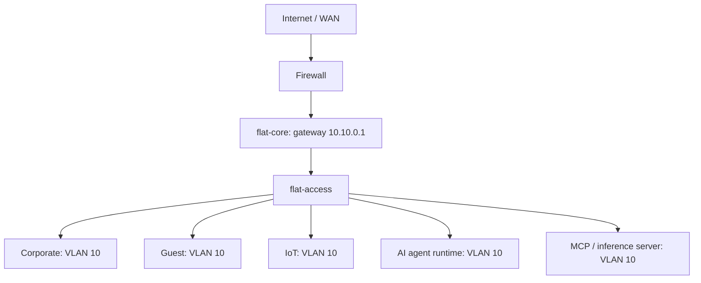
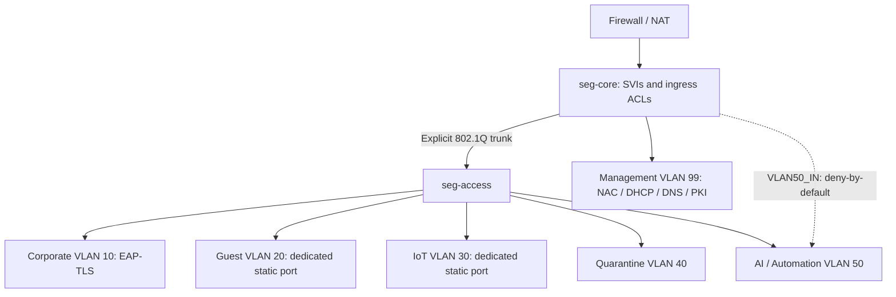
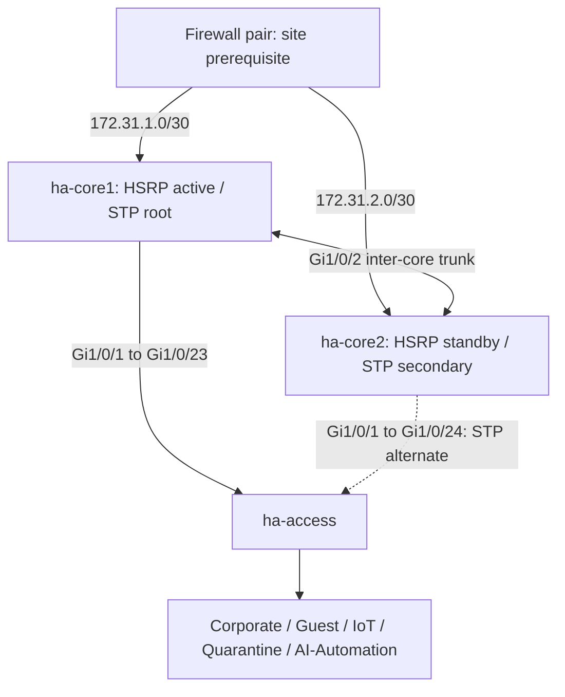
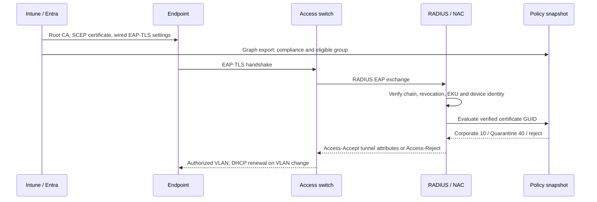
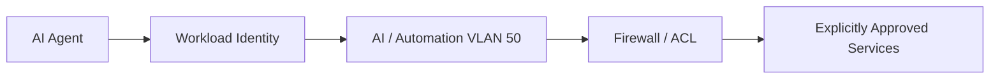
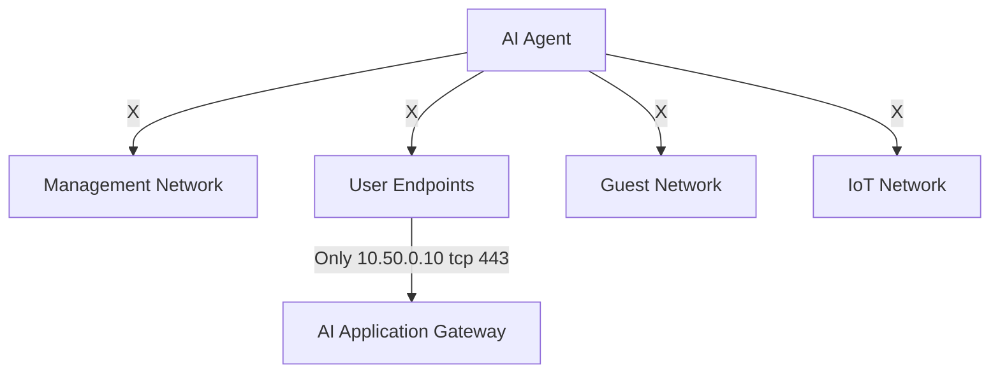
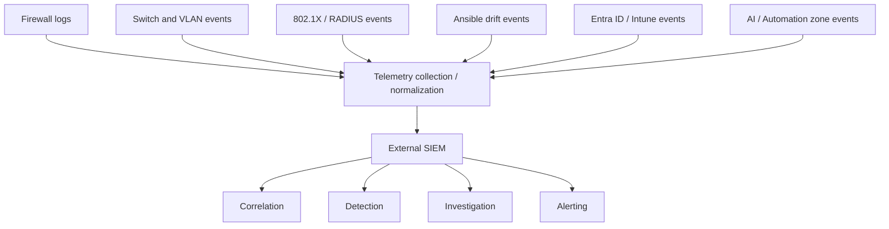

# Enterprise VLAN Segmentation with Microsoft Intune & Entra ID Integration

Reproducible Cisco IOS XE templates, Ansible drift management, and a Microsoft Graph compliance-to-RADIUS reference integration.

**Status:** engineering templates with offline validation. Qualify the switch model, IOS release, NAC adapter and tenant policies before production. No switches or tenant resources have been modified. The [acceptance runbook](docs/validation.md) defines the remaining deployment gates.

## Three network topologies

### Flat / Essential Single-Path Star



The intentional baseline shares one endpoint broadcast domain and management network. Port security and SSH restrictions do not provide zone isolation. 802.1X dynamic VLAN assignment and inter-zone ACLs are introduced in topology 2; multiple endpoint VLANs would invalidate the flat baseline.

Example AI agent and automation workloads (AI1, AI2) are deliberately placed inside the same Layer-2 trust domain as conventional endpoints. They share the broadcast domain with user workstations, guests and IoT, which is exactly the risk this baseline documents: a compromised agent can reach any peer directly, steal credentials presented on the segment, access infrastructure management interfaces without an ACL in the path, and exfiltrate over unrestricted outbound connections. See [AI / Automation Workload Segmentation](#ai--automation-workload-segmentation).

### Segmented Wired Star



The AI / Automation trust zone is a dedicated VLAN (50, 10.50.0.0/24) for agent runtimes, MCP servers, local inference servers, automation workers and API orchestration services. Inter-zone traffic is enforced at the core SVI by the deny-by-default VLAN50_IN ingress ACL (dashed edge): only the approved resolver, NTP source, explicitly approved internal services and explicitly approved egress destinations are permitted. Corporate users reach exactly one AI destination, the application interface at 10.50.0.10 tcp 443. See [AI / Automation Workload Segmentation](#ai--automation-workload-segmentation).

### High-Availability Segmented Star



Two independent trunks dual-home the access switch. RSTP changes the forwarding path; HSRPv2 retains the `.1` gateways. Core 1 uses `.2`, core 2 `.3`. DTP is disabled: explicit allowed VLANs prevent unintended negotiation. Independent cores must not share an ordinary LACP port-channel without a supported stack/MLAG design. The AI VLAN exists on both cores with HSRP group 50 (VIP 10.50.0.1) and identical VLAN50_IN ACLs; see [HA and VRRP alternative](docs/ha.md).

## Identity flow



Intune delivers certificates; Entra dynamic groups scope eligible devices; RADIUS authorizes the VLAN. Conditional Access does not configure switch ports. The evaluator needs a NAC adapter and is not an NPS plugin. Traditional NPS uses AD-backed identity mapping rather than native Graph compliance evaluation. See [integration and NPS deployment](docs/identity-integration.md).

### AI / Automation Workload Segmentation

AI agents, MCP servers, local inference servers, automation workers and API orchestration services are treated as privileged non-human workloads with their own trust boundary, not as another user device class.

**Topology 1 intentionally demonstrates the risk of AI workloads operating inside a flat trust domain. Topologies 2 and 3 introduce a dedicated AI / Automation Trust Zone.**

1. Autonomous agents are a distinct workload class because they act without a human in the loop, hold credentials to many systems at once, and can be steered by malicious input (prompt injection) into misusing legitimate tools. A compromised agent does not just read data; it executes.
2. AI workloads must not inherit user-network trust because their blast radius differs from a workstation's: they aggregate credentials, run continuously, and are reachable by design from automation pipelines. Placing them in the user VLAN would extend every agent compromise into every workstation and vice versa.
3. Network isolation alone is insufficient. A VLAN without workload identity cannot distinguish a legitimate agent from a compromised tool server on the same segment; without least-privilege egress and allowlisted destinations, a segmented agent can still exfiltrate or pivot through permitted paths. Defense here is segmentation plus identity plus policy plus monitoring.
4. Workload identity complements VLAN segmentation: the VLAN and its ingress ACL constrain where packets may go, while a per-workload identity (service principal, managed identity, dedicated automation account) constrains which workload may act and which credentials it holds. See [human versus non-human identity](docs/identity-integration.md#human-identity-versus-non-human-workload-identity).
5. Least-privilege egress reduces exposure because most agent compromises monetize through outbound connections (data exfiltration, C2, unapproved model APIs). VLAN50_IN permits only named destinations and ports: the approved resolver and NTP source, explicitly approved internal services, and explicitly approved external HTTPS endpoints. Everything else, including arbitrary RFC1918 space and the open Internet, denies.
6. Ansible detects drift affecting the AI trust boundary in two layers. `playbooks/audit_only.yml` audits device state against the golden desired state and reports a secret-free `drift.json` without writing. `playbooks/validate-ai-trust-zone.yml` validates the desired state itself offline: VLAN 50 presence and naming, trunk membership, VLAN50_IN presence and Vlan50 binding, absence of broad permit rules, absence of non-established AI-to-management permits, deny-all ordering, and ha-core1 versus ha-core2 consistency. `playbooks/enforce.yml` is the only writer and requires a change ticket.
7. Across topologies: Topology 1 keeps example AI workloads inside the single VLAN 10 broadcast domain as the documented risk baseline. Topology 2 adds the AI/Automation VLAN 50 with the deny-by-default VLAN50_IN ingress ACL on the core SVI. Topology 3 carries the same trust zone across both redundant cores with HSRP group 50 and identical ACLs.



Default-denied relationships (X marks denied connectivity):



Default AI VLAN policy intent (implemented in `scripts/render.py`, function `ai_acl`):

- AI_AUTOMATION to USER_VLAN, GUEST_VLAN, MANAGEMENT_VLAN, IOT_VLAN: DENY
- AI_AUTOMATION to corporate servers: DENY except the explicitly approved inference/API service
- AI_AUTOMATION to DNS/NTP: ALLOW the approved resolver and NTP source only
- AI_AUTOMATION to Internet: ALLOW only the explicitly approved HTTPS egress destinations
- MANAGEMENT_VLAN to AI_AUTOMATION: not restricted by any ingress ACL on Vlan99; management-originated protocols into VLAN 50 are currently unrestricted (known gap, not least-privilege). The AI-side return path is an `established`-only ACE, so AI-initiated connections to management still deny
- USER_VLAN to AI_AUTOMATION: ALLOW only the approved user-facing application interface

Reference values (VLAN 50, 10.50.0.0/24, AI_AUTOMATION) are examples driven by the `ai_trust_zone` block in each segmented `intent.json`; change them there and regenerate. Further reading: [AI agent threat model](docs/ai-agent-threat-model.md), [AI network validation](docs/ai-network-validation.md), [AI trust zone logging](docs/ai-trust-zone-logging.md).

## Repository structure

```text
topologies/
  01-flat/          intent.json + configs/
  02-segmented/     intent.json + configs/
  03-ha/            intent.json + configs/
  templates/       switch.ios.j2
ansible/
  inventory.ini, ansible.cfg, requirements.yml, requirements.txt
  group_vars/all.yml
  golden/          generated per-switch resource models
  playbooks/       audit_only.yml, enforce.yml, validate-ai-trust-zone.yml,
                   validate-models.yml, validate-one.yml
                   (audit.yml is a backwards-compatibility shim)
  roles/vlan_enforce/tasks/{main,resources}.yml
intune_entra_id/
  scripts/         Graph helpers, group/SCEP publishing, compliance export
  policies/        dynamic device group and SCEP JSON
  radius/          fail-closed evaluator and vendor-neutral adapter contract
docs/              addressing, deployment, identity, HA, validation,
                   ai-agent-threat-model, ai-network-validation, ai-trust-zone-logging
siem_integration/   SIEM boundary: schemas, examples, syslog, Ansible
                   drift-event exporter, telemetry and detection docs
scripts/           deterministic renderer and validator
tests/             authorization and traffic-boundary tests
.github/workflows/ offline checks and Ansible syntax validation
```

## Architectural decisions

| Decision | Reason / boundary |
|---|---|
| Corporate, Guest, IoT, Management, Quarantine | Routed isolation; same-VLAN peers need additional controls |
| AI / Automation trust zone (VLAN 50) | Privileged non-human workloads get deny-by-default policy, not user trust; a VLAN alone is not sufficient protection |
| SVI ingress ACLs | Restricted infrastructure exceptions; stateless, not a firewall replacement |
| Static dedicated Guest/IoT ports | Supports non-802.1X devices without corporate MAB fallback |
| Certificate plus current compliance | Possessing a certificate alone does not prove device health |
| 15-minute snapshot expiry; 24-hour sync threshold | Explicit stale-data policy; tune for site requirements |
| Periodic reauthentication | Existing sessions change on reauth; no automatic CoA implementation claimed |
| Scoped resource reconciliation | Repairs owned drift without deleting unrelated VLANs |
| Separate bootstrap | Routing, AAA, STP and secrets need a reviewed initial configuration |

## Deployment

Use Python 3.11+ to render and validate:

```bash
python -m venv .venv
# Linux/macOS: source .venv/bin/activate
# PowerShell: .\.venv\Scripts\Activate.ps1
python -m pip install -r requirements-dev.txt
python scripts/render.py
python scripts/validate.py
python -m unittest discover -s tests -v
```

Edit the selected `intent.json` and template, regenerate, and review the diff. The generated `.cfg` files contain deliberate secret placeholders and must not be applied unchanged. The three topologies overlap in addressing and are alternatives. Review [addressing and dependencies](docs/addressing.md), then [deployment and rollback](docs/deployment.md).

Run Ansible from Linux or WSL with verified SSH host keys and out-of-band recovery:

```bash
python -m pip install -r ansible/requirements.txt
ansible-galaxy collection install -r ansible/requirements.yml
mkdir -p artifacts
chmod 700 artifacts
cd ansible
export NETWORK_USER=network-automation
# Store vault_network_password and vault_enable_password in this encrypted file.
ansible-vault create ../artifacts/network-vault.yml
ansible-playbook playbooks/audit_only.yml --limit seg-access \
  -e @../artifacts/network-vault.yml --ask-vault-pass
ansible-playbook playbooks/validate-ai-trust-zone.yml
ansible-playbook playbooks/enforce.yml --limit seg-access --check \
  -e change_ticket=CHG-1234 -e @../artifacts/network-vault.yml --ask-vault-pass
ansible-playbook playbooks/enforce.yml --limit seg-access \
  -e change_ticket=CHG-1234 -e @../artifacts/network-vault.yml --ask-vault-pass
```

Audit writes a secret-free `drift.json` under `artifacts/ansible/` and succeeds even when drift is found. Enforcement backs up first, changes one switch at a time, checks convergence and then saves. Its `--check` mode audits without switch writes. Device results are suppressed to protect secrets.

Automatic remediation carries operational risk: enforcement reconciles devices toward the golden desired state, so a stale repository or an undocumented emergency change gets reverted as if it were drift. An intentional manual change applied during an incident (for example, a temporary AI egress exception) will be removed by the next enforce run unless it is first recorded in `intent.json` and regenerated. Treat every non-empty `drift.json` as a decision, not a command: audit and report on a schedule, and enforce only with a reviewed change ticket after confirming the desired state matches intent. This applies doubly to the AI trust zone, where an automatic revert can either reopen a broad permit or break a legitimate workload with no human in the loop to notice.

For Intune, follow [the PowerShell workflow](docs/identity-integration.md): pilot group, root certificate, SCEP profile, wired EAP-TLS profile, then the NAC adapter. No tenant IDs, real credentials or private certificate material are included.

## Validation scope

CI parses data and PowerShell, verifies deterministic generated files, runs authorization/boundary tests, syntax-checks Ansible, validates Cisco resource schemas, and renders switchport/ACL commands offline. AI trust zone checks include the `test_ai_*` boundary tests, the `validate-ai-trust-zone.yml` desired-state assertions (broad-permit detection, established-only management return, deny-all ordering, HA core consistency), and the `scripts/validate.py` topology invariants (VLAN 50 present in topologies 2 and 3, absent from topology 1). It does not emulate IOS, issue certificates, verify Graph permissions or prove HA convergence. Dependency pins provide repeatability and need periodic review.

## SIEM Integration and Security Telemetry

Segmentation and ACLs are preventative controls. They stop what the policy forbids, but they do not tell you what tried to happen. This repository is therefore designed so that network and identity controls **produce security telemetry**, that telemetry is **normalized and exported**, and an **external SIEM** performs correlation, detection, investigation, and alerting.

```text
Control
    |
    v
Telemetry Generated
    |
    v
Normalization
    |
    v
Secure Transport
    |
    v
External SIEM
    |
    v
Correlation / Detection
```

The five layers are deliberately separated:

1. **Telemetry source**: the device or service that observed the event (firewall, switch, RADIUS, Entra ID, Ansible job).
2. **Telemetry transport**: how the event moves (syslog, syslog over TLS, Windows Event Forwarding, HTTPS API, Graph API, structured JSON files).
3. **Normalization**: conversion into the common event baseline documented in [siem_integration/docs/event-normalization.md](siem_integration/docs/event-normalization.md).
4. **SIEM ingestion boundary**: the point where this repository's responsibility ends. Schemas, examples, and exporters live here; no SIEM platform does.
5. **Detection and correlation**: owned entirely by the external SIEM. This repository does not provide SOC monitoring, dashboards, threat hunting, or case management.



### Telemetry sources

| Telemetry Source | Example Events | Security Value | Suggested Transport |
|---|---|---|---|
| Firewalls | Allow/deny events, rule changes, administrative logins, inter-VLAN policy violations | Detect segmentation bypass attempts and unauthorized rule changes | Syslog, syslog over TLS |
| Layer 3 switches | SVI ACL deny hits, inter-VLAN denies | Detect east-west policy violations at the routing boundary | Syslog, syslog over TLS |
| Managed switches | Port state changes, VLAN/trunk changes, port-security violations, configuration modifications | Detect unauthorized topology changes and unexpected VLAN assignments | Syslog, syslog over TLS |
| 802.1X / RADIUS / NPS | Authentication success/failure, method, policy selected, assigned or rejected VLAN | Detect credential attacks and authorization faults | Syslog, Windows Event Forwarding, NPS log files |
| Microsoft Entra ID | Sign-ins, Conditional Access results, administrative role changes, service principal activity | Detect identity attacks and privilege changes | Microsoft Graph API, HTTPS API |
| Microsoft Intune | Device compliance state, device registration or removal | Detect unhealthy or unknown devices joining the network | Microsoft Graph API |
| Ansible drift jobs | `configuration_drift` events with expected vs observed state | Detect unauthorized configuration changes, including AI zone policy drift | Structured JSON file or stdout |
| Administrative changes | Configuration diffs with actor identity where available | Accountability for management-plane actions | Syslog, structured JSON |
| DHCP / DNS | Lease anomalies, unexpected DNS destinations | Detect rogue devices and suspicious name resolution | Syslog |
| AI / Automation Trust Zone | AI policy violations, unapproved outbound connections, repeated ACL denials | Detect compromised agents and exfiltration attempts | Syslog over TLS, structured JSON |
| AI agent / MCP audit events, when available | Tool invocations, workload identity authentication | Correlate network flows to agent behavior for higher-confidence investigation | HTTPS API, structured JSON |

Not every platform supports every transport; vendor-specific capabilities are labeled in [siem_integration/docs/telemetry-sources.md](siem_integration/docs/telemetry-sources.md). Vendors such as Microsoft Sentinel, Splunk, Elastic, Wazuh, Axiom, QRadar, and Graylog are possible downstream consumers only. None are required, and no SIEM-specific dashboards are implemented.

Start here: [SIEM integration overview](siem_integration/README.md), [telemetry sources](siem_integration/docs/telemetry-sources.md), [event schemas](siem_integration/docs/event-normalization.md), [detection use cases](siem_integration/docs/detection-use-cases.md), and the [monitoring requirements](SECURITY.md#security-monitoring-and-siem-integration) in SECURITY.md.

## References

- [Cisco dynamic VLAN assignment](https://www.cisco.com/c/en/us/td/docs/ios-xml/ios/sec_usr_8021x/configuration/xe-3e/sec-usr-8021x-xe-3e-book/sec-ieee-8021x-vlan-assign.html)
- [Graph managedDevice](https://learn.microsoft.com/en-us/graph/api/resources/intune-devices-manageddevice?view=graph-rest-1.0)
- [SCEP Graph schema](https://learn.microsoft.com/en-us/graph/api/resources/intune-deviceconfig-windows81scepcertificateprofile?view=graph-rest-beta)
- [Entra join and RADIUS limitations](https://learn.microsoft.com/en-us/entra/identity/devices/device-join-plan)
- [Ansible IOS collection](https://docs.ansible.com/projects/ansible/latest/collections/cisco/ios/index.html)

MIT licensed; see [LICENSE](LICENSE).
